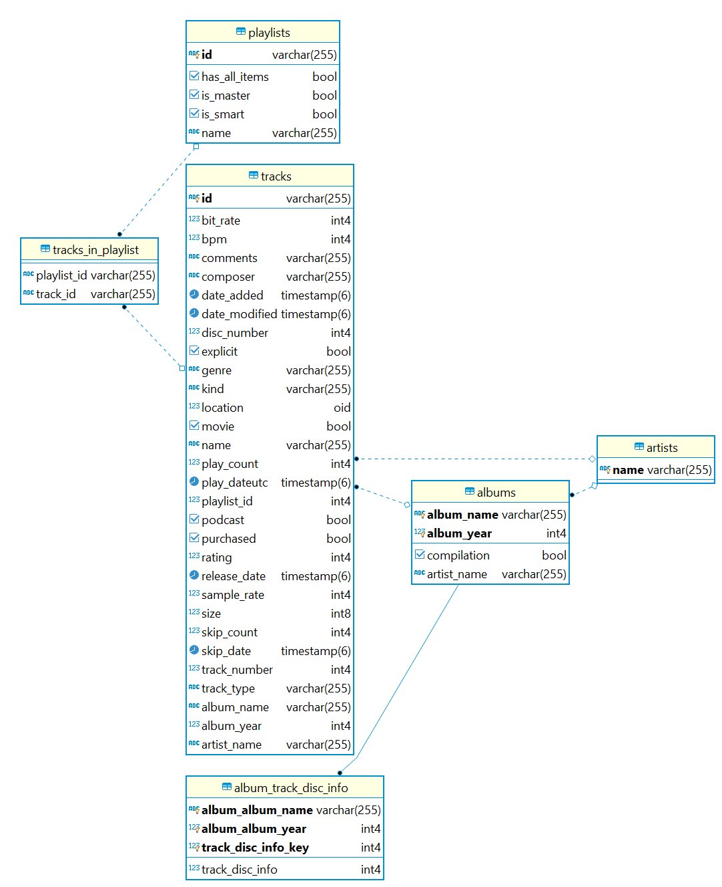

# itunes-library-service  
This Spring Boot microservice is designed to work with iTunes media library (tracks, albums and artists).

- **Database initialization**
    - [Parse data from XML file](#Parse-data-from-XML-file)
    - [Use predefined schema and data](#Use-predefined-schema-and-data)
    
    
 - [**Database selection**](#Database-selection)
 - [**API documentation**](#API-documentation)
    
----
### Database initialization
Microservice database can be initialized in two ways.

##### Parse data from XML file
1. Save XML media library form iTunes application;
2. Put the XML file in resource folder (`itunes-library-service-impl/src/main/resources/library.xml`);
3. Enable parsing by setting `itunes-library-service.startup-parsing` to **true** in `application.xml`;
4. Run the application.

##### Use predefined schema and data
1. Disable parsing of the file-based library by setting `itunes-library-service.startup-parsing` to **false** in `application.xml`;
2. Create a new database in PostgreSQL, e.g. `itunes-library` with required login and password;
3. Set URL to the created database in properties, e.g. `spring.datasource.url=jdbc:postgresql://localhost:5432/itunes_library`;
4. Create new schema inside the specified database, e.g. `library` and set it in properties: `spring.jpa.properties.hibernate.default_schema: library`;
5. Preapre SQL scripts with data t be populated. Current Entity Relation diagram is:

6. Save SQL scripts in resource folder (e.g. `resources/sql`) and set paths:
- schema.sql - `spring.datasource.schema=classpath:sql/schema.sql`;
- data itself - `spring.datasource.data=classpath:classpath:sql/artists.sql, classpath:sql/albums.sql, classpath:sql/tracks.sql, classpath:sql/trackdiscinfo.sql`;
7. Run the application.

#### Database selection
The microservice can work with h2 (embedded or file-based) database and PostgreSQL as well. To select a required database type run the application with proper profile (**dev-h2** or **dev-pg** respectively, see `application.xml` for more details).

#### API documentation

API documentation for running server by default is available here:
- Swagger 2: http://localhost:8081/swagger-ui.html
- OpenAPI 3: http://localhost:8081/api/v1/library/swagger-ui.html